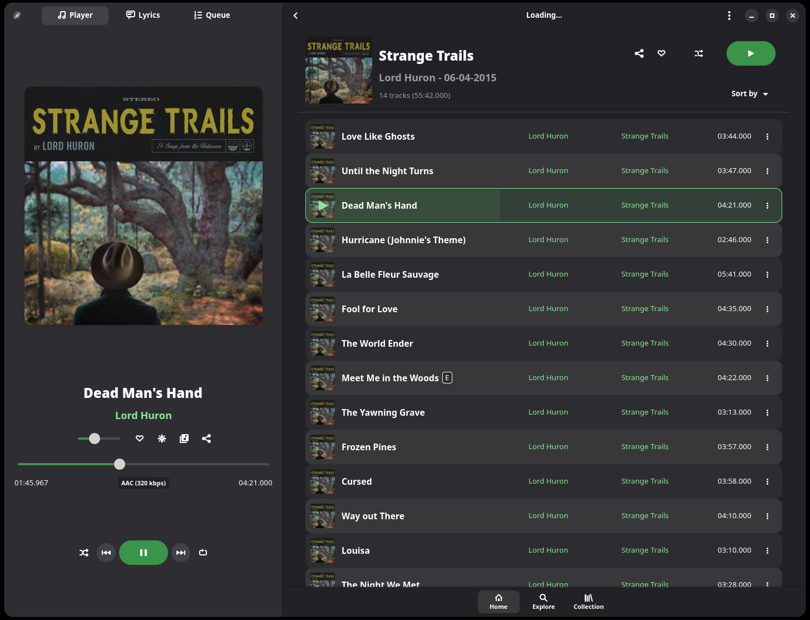
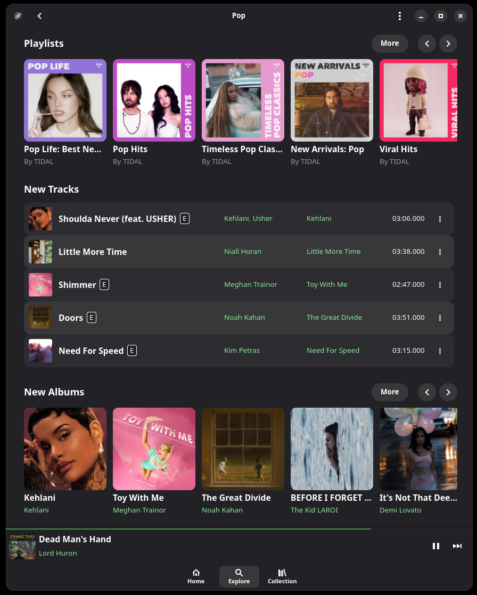

<div align="center">
  
  
  # High Tide Parallel ([Forked From Nokse22](https://github.com/Nokse22/high-tide))
  
  <p align="center">
    <strong>Linux client for TIDAL streaming service</strong>
  </p>
  
  <p align="center">
    <a href="https://www.gnu.org/licenses/gpl-3.0">
      
    </a>
    <a href="https://www.python.org/">
      
    </a>
  </p>
</div>

<div align="center">
  <p>Made with ❤️ by the High Tide community</p>
  <p>
    <a href="https://github.com/Nokse22/high-tide">View on GitHub</a> • 
    <a href="https://github.com/Nokse22/high-tide/issues">Report Bug</a> • 
    <a href="https://github.com/Nokse22/high-tide/issues">Request Feature</a>
  </p>
</div>


> [!IMPORTANT] 
> Not affiliated in any way with TIDAL, this is a third-party unofficial client

<table>
  <tr>
    <th></th>
    <th></th>
  </tr>
</table>

## 🚀 Installation

My fork currently doesn't have any builds pushed out via any distribution methods. The only way to install High-Tide-Parallel currently is through building from source.

### ⚡ From source (binary)

You just need to clone the repository, and build with meson. You will have to install various dependencies like:

#### Package Managers Install
- python-gobject
- gobject-introspection
- blueprint-compiler

#### System-wide Pip Install
- tidalapi
- pypresence
- colorthief

Afterwards the build should proceed successfully, milage may vary depending on distro.

```sh
git clone https://github.com/Lasse-NP/high-tide-parallel.git
cd high-tide-parallel
meson setup --wipe build --prefix=/usr/local --wrap-mode=nofallback
meson compile -C build
meson install -C build
```

Or open the project in GNOME Builder and click "Run Project".

## ❌ Uninstallation

Since this fork is only installable via building from source, it is of course only uninstallable by using tools such as Ninja.

```sh
# Head to the GIT clone location.
cd high-tide-parallel
sudo ninja uninstall -C build
```

## 🤝 Contributing and Supporting the Project

I am doing this of my own free will, wanting to improve a music player that i enjoy. If you want to support the project, instead head to the original repository and support Nokse22 directly.

## 📄 License

This project is licensed under the GNU General Public License v3.0 - see the [LICENSE](COPYING) file for details.
